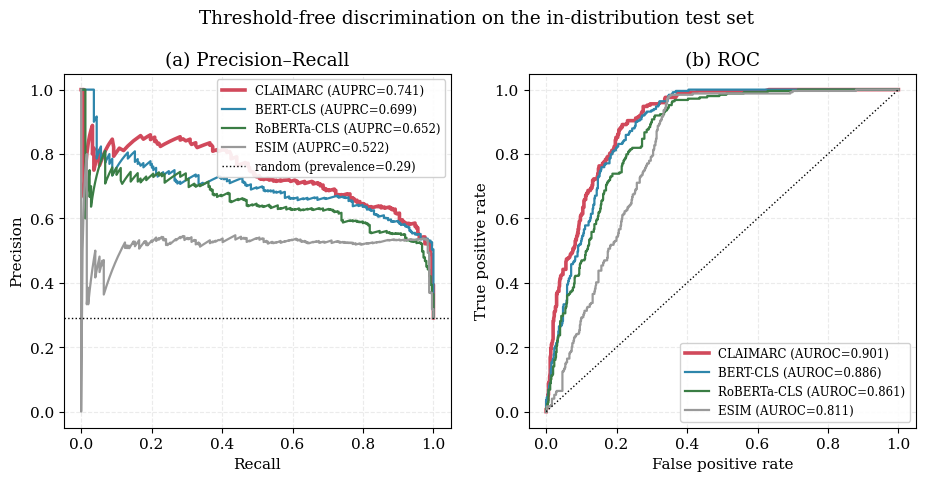
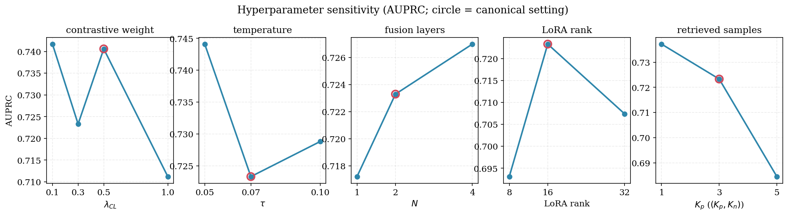
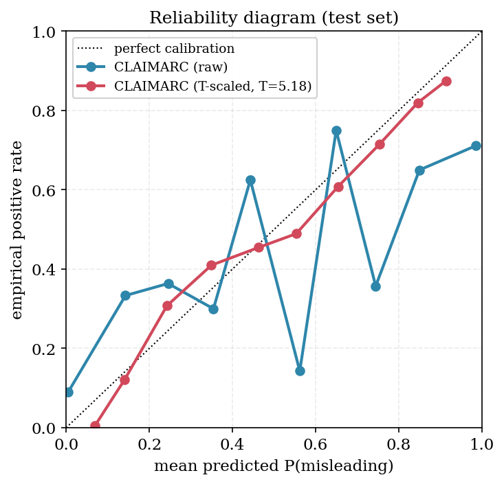

# 4 实验结果与分析

本章实验围绕四个研究问题展开。**RQ1**：在主分布上，CLAIMARC 能否稳定优于客观事实核验、文本分类、冻结编码器检索探针与大语言模型四类基线？**RQ2**：检索增强对比学习（RACL）能否在"话术与事实高度相似、却因细微差异引发相反感知标签"的边界样本上塑造出可分的表征——拉近同标签、推开反标签？**RQ3**：模型能否迁移到未见的品类与主播？冻结编码器的检索库能否在不重训参数的前提下吸纳新域？**RQ4**：各组件、检索策略与超参选择对最终性能各有多大贡献、是否稳健？下文 §4.4 回应 RQ1，§4.5 回应 RQ3，§4.6 回应 RQ2，§4.7 至 §4.9 回应 RQ4 并考察模型的部署表现。

## 4.1 数据集与描述性统计

实验语料覆盖 2024 年 10 月至 2025 年 3 月采集的中文直播电商数据。经 §3.2.1 流水线（品类内属性标准化、主播话术对齐、三源商品事实抽取）处理后，每条实例对应一个「商品–属性」$(p, a)$ pair。除由评论驱动得到感知标签的 pair 外，我们另行挖掘**客观负例**（objective-negative）pair，即主播确有口播、但无任何对齐消费者评论的属性；这类样本不携带感知误导信号（$y=0$），并按商品侧证据覆盖度加权。最终数据集共 **4,883** 条 pair，覆盖 10 个一级品类、38 个二级品类、108 个直播间、1,532 个标准化属性，其中评论驱动样本 2,278 条、客观负例 2,605 条，整体正例（感知误导）占比 **25.6%**。可见本任务是一个典型的类别偏倚筛查问题，而非均衡分类。

我们按 `room_id` 分组、以 70:10:20 切分 train/val/test，并使同一直播间的全部 pair 严格落入同一划分，从根本上杜绝主播身份泄漏（Table 1）。三个划分的正例率分别为 24.2%、31.1% 与 29.1%，分布足够接近，可将测试集视为有代表性的样本。证据来源覆盖度（三类商品事实来源中同时命中的个数为 0/1/2/3）对应 1,483 / 1,826 / 1,118 / 456 条，平均 1.11；逐 pair 的实例级可靠性权重 $c_{p,a}$ 均值 0.456、中位数 0.48，主体落于 [0.18, 0.82]。主播话术片段平均约 23 字、商品事实文本约 22 字；46.7% 的 pair 至少对齐 1 条相关消费者评论，平均每条 pair 对齐 6.9 条、其中 1.5 条为负向，构成感知标签的经验依据。品类分布见 Table 2，呈服饰、母婴与通用类居多的长尾结构，而这一长尾正是 §4.5 跨品类迁移所要施压的对象。

**Table 1.** Room-grouped partitions (70:10:20 by `room_id`). Comment-driven: 2,278; objective-negative: 2,605. Evidence-source coverage (0/1/2/3): 1,483/1,826/1,118/456. Reliability weight $c$: mean 0.46, median 0.48, range [0.18, 0.82].

| Split | #Pairs | Pos.% | #Rooms |
|---|---:|---:|---:|
| Train | 3,636 | 24.2 | 92 |
| Val | 392 | 31.1 | 5 |
| Test | 855 | 29.1 | 11 |
| **All** | **4,883** | **25.6** | **108** |

**Table 2.** Category distribution (10 first-level categories).

| Category | #Pairs | Category | #Pairs |
|---|---:|---|---:|
| apparel_and_underwear | 1,274 | smart_home | 324 |
| general | 827 | digital_and_electronics | 270 |
| baby_kids_and_pets | 715 | sports_and_outdoor | 262 |
| shoes_and_bags | 476 | beauty_and_personal_care | 225 |
| food_and_beverages | 426 | jewelry_and_collectibles | 84 |

## 4.2 基线设置

我们设置三类基线，分别用以排除一种可能的替代解释。所有系统在相同划分、相同输入预算、相同可靠性加权监督、相同验证集选阈值下训练或评估；非大模型系统均在单张 24G RTX 4090 上完成。

**（A）客观事实核验。** 这一类刻画"把监督锚点设为话术与证据间是否存在可机械验证的逻辑矛盾"时所能达到的判别上限，覆盖成对蕴含建模的常见谱系：**ESIM**（Chen et al., 2017；BiLSTM 加注意力软对齐、差积组合与池化）、以注意力"对齐–比较–聚合"取代循环结构的 **Decomposable Attention**（Parikh et al., 2016，一种标准的非循环 NLI 基线），以及联合读取话术与证据的中文 **BERT-NLI 跨编码器**。

**（B）文本分类。** 这是与本方法最接近的一类。从零训练的神经基线为 **TextCNN**（Kim, 2014）与带池化的 **BiLSTM**；单流微调编码器 **BERT-base-chinese** 与 **Chinese-RoBERTa-wwm-ext** 以 `[CLS] X^c [SEP] X^e [SEP]` 输入、由 `[CLS]` 隐式承载话术与证据的对照，其中全词遮蔽的 RoBERTa 用以排除"骨干容量不足"这一混淆解释。

**（C）冻结编码器检索探针。** 这一类检验在任何对比训练之前，表征里已经蕴含了什么：在冻结 BGE 成对特征上分别训练逻辑回归、线性 SVM 与 MLP，以及在冻结 BGE 嵌入上做可靠性加权的 $k$ 近邻投票。其中的 $k$ 近邻投票把 CLAIMARC 的推理规则原样搬到未经训练的表征空间，是检验 RACL 价值最紧的对照，呼应了 RGCL（Mei et al., 2024）的检索引导对比学习设置。

**（D）大语言模型。** 这一类考察通用大模型在零样本、少样本与同等监督微调三种条件下的能力边界，包含四个网关大模型（GPT-5.4、Qwen-Flash、Gemini-3.5-Flash、Kimi-K2.6）在**零样本**与**五样本思维链（CoT）**下的判定（统一将属性、主播话术与商品事实并列输入，不提供消费者评论与弱标签），以及 **Qwen2.5-7B-Instruct + LoRA 监督微调**——在与 CLAIMARC 完全相同的训练集与监督信号上做指令式二分类微调，以将"框架设计"与"原始参数容量"两种解释剥离开。

## 4.3 评估指标

识别消费者感知误导，本质上是一个类别偏倚、面向排序的筛查问题：正类为少数，部署时的目标是把风险话术排序后交合规审核优先处理。为保证各表口径一致、便于横向比较，我们对所有分类实验统一汇报一组在偏倚分类研究中常用、且能直接反映筛查效用的指标。其中两项与阈值无关：**AP**（average precision，即 precision–recall 曲线下面积，亦记 AUPRC）为主指标，是正例稀疏时排序质量的规范度量；**AUC**（即 AUROC）刻画阈值无关的可分性。另两项与阈值相关：**Accuracy** 与正类 **F1**（记 F1$_{pos}$），二者均在验证集上选定单一阈值后，原样应用于测试集。由于 CLAIMARC 工作在高召回操作点（契合筛查需求），其所报告的 F1$_{pos}$ 已在该点对精确率与召回率作了权衡。我们不汇报 MCC 与 Macro-F1：前者在退化的零样本大模型预测上没有可比的连续分数，后者在各胜任系统之间近乎饱和、相对上述四项几无增量。配对显著性以 $n=2{,}000$ 的配对 bootstrap 在测试集预测上估计。

**实现细节。** 共享骨干为 BGE-large-zh-v1.5（$d=1024$），与融合模块、任务头一道端到端全参微调；这使 CLAIMARC 与其对照的全参微调编码器基线处于同一训练口径。一个参数高效的配置——保持骨干冻结、仅在 query/value 投影上施加 LoRA（$r=16$，$\alpha=32$）——作为消融报告（§4.7），并支撑 §4.8 的检索库增量部署；它以四分之一的可训练参数即可恢复大部分排序质量。TwoStreamFusion 堆叠 2 个 pre-LN 块（8 头、共享双向交叉注意力、SwiGLU 前馈）。训练分两阶段：先以 3 个 epoch 的可靠性加权二元交叉熵热身，再以 6 个 epoch 引入权重为 $\lambda_{CL}$ 的 RACL，并在每个 epoch 按（属性，$y$）分桶重建 FAISS 索引；取 $\tau=0.07$、$K_p=3$、$K_n=5$，$\lambda_{CL}=0.5$ 由验证集选定（§4.8）。优化采用 AdamW，编码器学习率 $1\times10^{-5}$、头部学习率 $1\times10^{-4}$、bf16 精度、有效批量 36。推理侧 CLAIMARC 采用前向分类器（CLS）出分，各表头条指标即取自该分类器；检索增强 $K$ 近邻投票（RKC）不参与默认推理，而用于免梯度的新域吸纳（§4.5）与配合 CLS 支持人工弃判的选择性预测（§4.9）。所有可学习系统——CLAIMARC、各微调编码器与从零训练的神经基线——均在 3 个随机种子（0、1、2）下训练，主分布各表（Table 3 与消融 Table 7–9）一律汇报这 3 次运行的均值 $\pm$ 标准差；确定性的经典模型、冻结嵌入探针与大模型基线只运行一次。跨域实验（Table 4）中，留一品类协议汇报跨 10 折的均值与标准差，留 20 主播协议汇报跨 3 个种子的均值与标准差。

## 4.4 主对比（RQ1）

Table 3 在 14 条基线上汇报各系统在主分布测试集上的四项指标，可学习系统取 3 个种子的均值 $\pm$ 标准差（Accuracy 与 F1 的阈值在验证集上选定后用于测试集，详见 §4.3）。CLAIMARC 在全部四项指标上均为最优：Accuracy 82.6、F1$_{pos}$ 73.4、AP 75.4、AUC 90.4，其中 AP 与 AUC 正是框架着力优化的与阈值无关的排序指标。优势最大处在两项排序指标：在同等端到端微调预算下，CLAIMARC 的 AP 较最强微调编码器（RoBERTa-CLS，69.0）高出 6.4、较 BERT-CLS（68.2）高出 7.2；F1$_{pos}$ 亦较 BERT-base（71.7）高出 1.7。Figure 1 的 precision–recall 与 ROC 曲线把这一优势落到实处：增益在召回率 0.6 以上的高召回区段最为明显，而这恰是筛查系统实际工作的区间。

逐类读下来可得五点结论。其一，客观事实核验是最弱的一类：ESIM 的 AP 仅 51.2，Decomposable Attention 为 60.5，连联合读取话术与证据的 BERT-NLI 跨编码器也止步 67.9。消费者事后判为误导的话术，在机械意义上极少与商品证据相矛盾，专为检测逻辑矛盾而设计的模型因而几乎无从着力——这恰说明感知误导无法化约为话术与证据的逻辑不一致。其二，从零训练的神经文本分类基线——TextCNN（AP 60.9）与 BiLSTM（66.3）——其排序质量明显受限，表明缺乏检索预训练的序列模型不足以捕捉感知风险信号。其三，零样本大模型彻底失败：AP 仅 27–29、AUC 不超过 0.50（不优于随机排序），五样本 CoT 亦无改善；其中 Gemini-3.5 与 Kimi 退化为近乎全负的预测，名义 Accuracy 不再具有参考价值。即便给予同等监督也仍不足：经 LoRA 微调的 Qwen2.5-7B 把零样本差距大幅收窄（AP 由 27 升至 63.8），却仍落后 CLAIMARC 逾 10 个 AP，甚至不及参数量小得多的 BERT-base，尽管其总参约为 CLAIMARC 的 20 倍。其四，也最为直接：单凭检索机制并不能解释结果——把 CLAIMARC 同样的可靠性加权 $k$ 近邻投票搬到**未经对比训练**的冻结 BGE 成对嵌入上，AP 仅 64.4，较 CLAIMARC 低约 11 个点；对该冻结空间最强的非对比探针（MLP）也只到 67.6。检索投票唯有在对比训练重塑了嵌入几何之后才奏效——增益来自学到的表征，而非推理规则本身。其五，CLAIMARC 的优势集中在排序、并能延伸到分布外：它在主分布上 AP 与 AUC 领先所有可学习基线，而如 §4.5 所示，这一排序优势在未见主播与品类上进一步扩大，恰是微调编码器的阈值点指标衰减更快之处。

**Table 3.** Main comparison on the test set (%, $N{=}855$, 249 positives) across 14 baselines in four groups. Trainable systems (ESIM, Decomposable Attention, BERT-NLI, TextCNN, BiLSTM, the fine-tuned encoders, and CLAIMARC) report mean ± standard deviation over three seeds; the frozen-encoder probes and the language models are run once. Accuracy and F1 use a validation-selected threshold; AP and AUC are the primary threshold-free metrics. Group (C) applies linear, MLP, and reliability-weighted kNN heads to *untrained* BGE pair embeddings, isolating what the representation already encodes before any contrastive training. Representative LLM rows are shown; all gateway models in zero-shot/5-shot score AP 27–29 and AUC ≤ 0.50, and Gemini-3.5 and Kimi collapse to a near all-negative prediction, so their accuracy is not informative. Best per column among the learned systems in bold.

| Group | System | Acc | F1 | AP | AUC |
|---|---|---:|---:|---:|---:|
| (A) Objective fact verification | ESIM | 73.8 ±0.6 | 65.9 ±2.1 | 51.2 ±1.6 | 79.9 ±1.3 |
|  | Decomposable Attention | 76.2 ±0.4 | 61.5 ±1.6 | 60.5 ±2.6 | 83.6 ±0.1 |
|  | BERT-NLI cross-encoder | 79.1 ±0.5 | 65.1 ±3.2 | 67.9 ±1.1 | 87.4 ±0.6 |
| (B) Text classification | TextCNN | 76.5 ±0.8 | 57.0 ±2.6 | 60.9 ±0.9 | 84.1 ±0.8 |
|  | BiLSTM | 79.2 ±0.3 | 65.5 ±2.6 | 66.3 ±0.9 | 86.4 ±0.3 |
|  | BERT-base + [CLS] | 80.9 ±0.5 | 71.7 ±1.0 | 68.2 ±1.8 | 88.3 ±0.4 |
|  | RoBERTa-wwm + [CLS] | 80.5 ±0.8 | 70.0 ±1.8 | 69.0 ±1.0 | 88.4 ±0.1 |
| (C) Frozen-encoder retrieval probes | BGE-frozen + LR | 77.0 | 68.5 | 66.4 | 86.6 |
|  | BGE-frozen + linear SVM | 76.0 | 68.0 | 60.5 | 84.8 |
|  | BGE-frozen + MLP | 78.6 | 67.4 | 67.6 | 86.4 |
|  | BGE-frozen + kNN vote | 78.1 | 62.1 | 64.4 | 83.0 |
| (D) Large language models | Qwen-Flash (0-shot) | 49.8 | 30.5 | 27.4 | 46.1 |
|  | GPT-5.4 (5-shot CoT) | 58.2 | 24.8 | 26.9 | 44.6 |
|  | Qwen2.5-7B + LoRA SFT | 73.0 | 61.7 | 63.8 | 81.9 |
| **CLAIMARC** | forward classifier (ours) | **82.6** ±0.4 | **73.4** ±0.5 | **75.4** ±1.3 | **90.4** ±0.4 |

## 4.5 跨域泛化（RQ3）

为检验前述部署主张，我们把跨域泛化设计成一组对照实验。所有系统都在源域训练、在未见目标域上测试，且不做任何目标域适应；CLAIMARC 的检索库仅由源域样本构成。Table 4 在两种协议下汇报 Accuracy、AUC、AP 与正类 F1；比较涵盖全部四种范式，包括两种大模型提示模式。

在**留一品类**协议下（依次留出 10 个一级品类，对 10 折取均值），CLAIMARC 在 Accuracy（81.8）、AUC（90.0）与 AP（71.0）三项上均最优，且跨品类波动最小（AUC 标准差仅 4.0，对照 BERT-CLS 的 4.7），对未见品类最为稳健。最强的微调竞争者 BERT-CLS 为 AUC 89.4、AP 70.1，CLAIMARC 以源域检索库完成迁移，将两项排序指标各抬高约 1 个点；其迁移力来自结构先验，而非对目标域重新拟合参数。在**留 20 主播**协议下（留出 20 个按评论量分层的直播间，对 3 个种子取均值），CLAIMARC 在两项排序指标上领先：AUC 93.1、AP 81.4，AP 较最强微调编码器高出约 2.5 个点；在 Accuracy（84.2）与 F1（73.4）这两项阈值点指标上，则与最强编码器处于种子噪声之内。优势最大处恰在部署最看重的与阈值无关的 AP 与 AUC 上，且较主分布更宽：属性结构可跨主播迁移，而说话风格不能。两种协议下，零样本与五样本大模型始终停留在随机附近或以下（AUC ≤ 0.52），可见通用模型的参数化先验无法迁移到消费者感知这一判别轴。

**Table 4.** Cross-domain generalization (%) under two protocols, reporting Accuracy, AUC, AP, and positive-class F1. All systems train on the source and test on an unseen target with no target adaptation; CLAIMARC's retrieval library is built only from the source pairs. Panel (a) reports mean ± standard deviation across the 10 held-out first-level categories; panel (b) reports mean ± standard deviation across three seeds for a fixed set of 20 held-out, comment-volume-stratified rooms. The learned systems are compared with the two language-model prompting modes (run once). CLAIMARC leads on the ranking metrics (AP, AUC) under both protocols and holds the tightest category spread (AUC 90.0±4.0 vs BERT-CLS 89.4±4.7); under streamer transfer it leads AP by ~2.5 points and is within seed noise of the best encoder on Accuracy and F1. In-domain reference AP is 75.4 (§4.4). Best per column among the learned systems within each panel in bold.

| System | Acc | AUC | AP | F1 |
|---|---:|---:|---:|---:|
| *(a) Leave-one-category (mean±s.d. over 10 folds)* | | | | |
| ESIM | 79.3 ±7.2 | 85.1 ±6.7 | 56.5 ±12.2 | **70.1** ±8.6 |
| BERT-CLS | 81.0 ±6.5 | 89.4 ±4.7 | 70.1 ±8.0 | 67.5 ±5.0 |
| RoBERTa-CLS | 81.0 ±4.6 | 88.5 ±4.3 | 67.3 ±6.7 | 66.2 ±8.1 |
| LLM zero-shot | 49.6 ±3.8 | 45.2 ±5.1 | 25.6 ±12.6 | 29.0 ±13.1 |
| LLM 5-shot CoT | 46.0 ±4.8 | 45.6 ±4.5 | 25.7 ±12.1 | 30.6 ±12.6 |
| **CLAIMARC** | **81.8** ±5.0 | **90.0** ±4.0 | **71.0** ±5.5 | 66.8 ±5.2 |
| *(b) Leave-20-streamers (mean±s.d. over 3 seeds)* | | | | |
| ESIM | 82.9 ±1.0 | 88.2 ±0.4 | 68.4 ±0.7 | **77.0** ±1.9 |
| BERT-CLS | 83.6 ±1.3 | 92.2 ±0.0 | 78.7 ±0.3 | 73.3 ±5.2 |
| RoBERTa-CLS | **84.5** ±0.4 | 92.0 ±0.2 | 78.9 ±0.8 | 75.6 ±1.4 |
| LLM zero-shot | 49.0 | 47.0 | 29.3 | 31.7 |
| LLM 5-shot CoT | 48.8 | 52.1 | 32.4 | 43.3 |
| **CLAIMARC** | 84.2 ±1.3 | **93.1** ±0.3 | **81.4** ±1.3 | 73.4 ±3.7 |

上面的比较把每个系统都冻结、在目标域上只读一次。但框架的主张更强：一个**冻结的** CLAIMARC，仅靠维护其检索索引、不做任何梯度更新，就能在新域上持续改善。我们在主播迁移下直接检验这一点。编码器在源域直播间上训练后冻结；随后把留出主播的标注 pair 按比例逐步写入检索库，并在**从不写入**的另一半留出主播上重新读取检索投票。前向分类器全程固定——作为参数化模型，它无法在不重训的情况下吸纳新主播——因而充当"零适配"参照。Table 5 给出结果：唯一可适配的检索投票随索引填充单调上升，AP 由仅含源域库的 65.5 升至全量目标覆盖时的 71.5（+6.0），AUC 由 80.3 升至 84.8（+4.5），操作点 F1 由 72.4 升至 74.9，在库满时反超冻结前向分类器的 F1（73.5）。关键在于增益平滑且早现——仅写入五分之一目标池即可实现约一半增益——故部署可增量吸纳新主播或新风险话术，每条仅需一次编码与一次入库写入。这正是部署论证背后的具体机制：因为 RACL 已把嵌入空间塑造得使感知风险结构在局部一致，向邻域投入少量目标样例即足以重新校准投票，而参数化模型则非经一次完整训练不能移动分毫。

**Table 5.** Gradient-free library adaptation under leave-20-streamers transfer (%, mean ± s.d. over 3 seeds). The encoder is frozen after source training; a growing fraction of the held-out streamers' labelled pairs is written into the retrieval library, and the retrieval vote is read on the disjoint, never-written half of the held-out streamers. The vote—the only adaptable component—improves monotonically with library coverage and overtakes the frozen forward classifier on F1 at full coverage, without any gradient step.

| Retrieval library on held-out streamers | AP | AUC | F1 |
|---|---:|---:|---:|
| Frozen forward classifier (no adaptation) | 81.1 ±0.9 | 93.1 ±0.3 | 73.5 ±2.9 |
| source pairs only | 65.5 ±1.8 | 80.3 ±2.6 | 72.4 ±1.9 |
| + 20% of target pool | 67.5 ±1.1 | 81.3 ±2.2 | 73.3 ±1.9 |
| + 40% | 69.0 ±1.2 | 82.7 ±1.7 | 73.8 ±2.6 |
| + 60% | 69.7 ±1.0 | 83.3 ±1.8 | 73.6 ±2.4 |
| + 80% | 70.7 ±1.2 | 84.3 ±1.6 | 74.4 ±2.6 |
| + 100% of target pool | **71.5** ±1.5 | **84.8** ±1.5 | **74.9** ±2.5 |

## 4.6 表征几何与边界敏感性（RQ2）

对比目标的价值应体现在它如何重塑标签几何：让感知误导样本与诚实样本在检索空间中更易分离，这正是 RKC 投票（§4.5）与免梯度库写入所依赖的结构。为把这一效果与既有方法区分开，我们设置一项严格受控的对照——同一 BGE 全量微调骨干、同一分类头、同一超参数，三个变体只在对比目标上不同：**无对比**（仅 BCE）、标准**监督对比** SupCon（Khosla 等，2020，批内同标签互为正例、异标签为负例，无检索与困难挖掘），以及本文的**检索增强对比 RACL**（全池伪金正例与困难负例，可靠性与类频加权）。所有指标均在测试集表征 $\mathbf{g}_{p,a}$ 上以 3 个随机种子度量、且与属性无关（训练集作检索索引、测试集作查询），结果见 Table 6。

可得三点结论。其一，**类可分性**：RACL 的标签 silhouette 达 0.422，高于标准 SupCon 的 0.349 与无对比的 0.196，且方差最小（±0.010，对 SupCon 的 ±0.173），是三者中最稳健的类分离；Figure 4 的 UMAP 投影以肉眼可辨的方式印证——RACL 把感知误导样本凝聚成一个明显分离的独立簇，无对比时两类彼此交织，标准 SupCon 居中。其二，**RACL 与标准 SupCon 的关键差异在于是否塌缩表征**：SupCon 把同标签压得最紧（alignment 0.478），却以牺牲均匀性为代价（uniformity 仅 −0.86），即把同类样本挤向一处；RACL 则在保持空间展开（uniformity −1.21）的同时取得更佳的类分离，落在 alignment–uniformity 平面上更利于检索的折衷区，从而避免了标准监督对比的表征塌缩（Wang 与 Isola，2020）。其三，**困难区**：把度量限制到"异标签最近邻最相似"的易混子集后，两种对比目标都把近邻纯度由 0.50 提升到 0.57，说明对比信号正作用于"语义相近却标签相反"的样本——这正是 RACL 以困难负例显式施压之处。需要说明的是，标签邻域纯度@10 在三者间基本持平（约 0.81）：BGE 全量微调本身已把标签一致的邻域结构建立起来，对比目标的独立贡献在于**类分离而非邻域纯度**。综合而言，对比训练塑造出更易分离、且未塌缩的检索几何，这正是检索投票与库写入式适配所依赖的结构，也呼应了 §4.5 中检索投票唯有在表征经对比重塑后方能奏效。

**Table 6.** Label-conditional geometry of the test retrieval embedding under three contrastive objectives sharing an identical BGE-full-fine-tuning backbone, classifier and hyper-parameters (3-seed mean±s.d.; metrics are attribute-free, with the train split as the retrieval index). RACL attains the best and most stable label silhouette; standard SupCon reaches the tightest alignment but at the cost of a collapsed (least uniform) space, whereas RACL preserves uniformity while separating the classes. Neighborhood purity@10 is already established by full fine-tuning and is comparable across objectives.

| Variant | Silhouette ↑ | Hard-region purity@10 ↑ | Alignment ↓ | Uniformity | kNN purity@10 |
|---|---:|---:|---:|---:|---:|
| w/o contrast | 0.196±0.053 | 0.500±0.043 | 1.121 | −2.02 | 0.811 |
| SupCon (Khosla et al., 2020) | 0.349±0.173 | **0.573±0.017** | 0.478 | −0.86 | 0.804 |
| **RACL (ours)** | **0.422±0.010** | **0.573±0.088** | 0.905 | −1.21 | 0.811 |

## 4.7 消融实验（RQ4）

我们在以全参微调为 canonical 的基础上、其余配置不变地逐一改动单个设计选择，并统一读取前向分类器，使各变体处于同一口径下可比。我们仿照近期检索–对比工作（Mei et al., 2024）的组织方式，分三张专表汇报，每张隔离一类设计选择：核心目标、加权与骨干组件（Table 7）、双流架构（Table 8）、检索增强对比的正/负例挖掘（Table 9）。所有数值均为 3 个种子的均值 $\pm$ 标准差，canonical 为各表加粗参照。

**核心目标、加权与骨干组件。** Table 7 逐一移除单个组件，每次改动都同时损及操作点与排序质量。去掉检索增强对比（仅交叉熵）使 F1 损失 2.6（73.4→70.8）、AP 损失 3.3；移除对噪声标签下采样的可靠性加权使 F1 损失 1.8、AP 损失 3.2；关闭对比的类平衡缩放——这一不平衡感知的精炼，使 26% 的误导类不致被多数类淹没——使 F1 损失 0.7、AP 损失 1.5。把分类与检索头的 ESIM 式四元组 $[\mathbf{h}_c,\mathbf{h}_e,\mathbf{h}_c-\mathbf{h}_e,\mathbf{h}_c\odot\mathbf{h}_e]$ 坍缩为朴素拼接 $[\mathbf{h}_c,\mathbf{h}_e]$，AP 损失 3.6、F1 损失 1.4，可见显式的差/积特征——话术与证据之间的落差信号——并非与融合所携信息冗余。把检索预训练的 BGE 换成 BERT-base，AP 损失 4.3，说明排序质量取自骨干的检索预训练、而非编码器规模。对比的全部价值在参数化的头无法弥补之处最为清楚：Table 3 中的非参数探针（在**冻结** BGE 成对嵌入上做可靠性加权投票）仅得 64.4 AP，对照对比训练后的 75.4；§4.5 的跨域检索库研究表明，同一投票唯有在对比重塑空间之后才变得有用。

**为何需要两条对照流。** Table 8 检验赋予框架名称的那一架构。我们以 canonical 双流模型对照三种退化：保留两条流但移除交叉注意力 TwoStreamFusion（仅拼接）、以及两种真正的单流模型——只把话术或只把证据喂入编码器、完全不做融合。仅证据流的模型**崩溃**——AP 跌至 48.4、AUC 跌至 68.7，仅略高于 29.1% 的正例率——因为感知风险标签存在于"证据是否与话术矛盾"之中，一旦移除话术，这一关系便无从读取。仅话术流稍好，但仍损失 5.0 AP，因为没有证据便无法把诚实话术与无据话术区分开。在两条流俱在的前提下，移除融合仍使 F1 损失 4.6、Accuracy 损失 1.9，是全部变体中操作点跌幅最大者，证实跨流交互（而非仅仅"两个编码器的存在"）才是把话术与其证据对齐的关键。两条流及其交互缺一不可。

**检索增强对比：抽取哪些样例。** Table 9 仿照 RGCL（Mei et al., 2024）的协议，消融对比的正/负例挖掘，并印证了文献提示的两点。其一，把伪金正例（相似度最高的同标签近邻）换成困难正例（相似度最低的同标签近邻）并无助益、且略降 F1（73.0 对 73.4），与"困难正例会破坏检索引导对比之稳定性"的报告一致。其二，限制负例——无论限于同属性 pair 还是限于同证据类型——都不曾胜过更简单的类平衡全集合，故 canonical 保留全集合。伪金正例的数量是惰性的（Kp $\in\{1,3,5\}$ 均在噪声之内），但困难负例的数量有明显最优：过少（Kn$=1$）损失 1.3 F1、过多（Kn$=10$）损失 4.2 F1，故 canonical 的 Kn$=5$ 恰为甜点，呼应"堆叠困难负例会损害检索–对比训练"的发现。

**Table 7.** Core objective, weighting, and backbone components, removed one at a time (%, forward classifier, mean ± s.d. over three seeds; canonical in bold). Every removal lowers both the operating point and the ranking metric, locating the contribution of each component.

| Variant (CLAIMARC, forward) | Acc | F1 | AP | AUC |
|---|---:|---:|---:|---:|
| **Canonical CLAIMARC** | **82.6** ±0.4 | **73.4** ±0.5 | **75.4** ±1.3 | **90.4** ±0.4 |
| w/o RACL contrast (CE only) | 81.2 ±1.1 | 70.8 ±2.0 | 72.1 ±2.3 | 89.4 ±0.9 |
| w/o reliability weight c | 81.6 ±1.3 | 71.6 ±1.6 | 72.2 ±3.1 | 89.5 ±0.7 |
| w/o class-balanced contrast | 82.1 ±0.5 | 72.7 ±1.9 | 73.9 ±0.4 | 89.9 ±0.2 |
| w/o ESIM 4-tuple head (concat only) | 81.4 ±0.6 | 72.0 ±1.7 | 71.8 ±2.3 | 89.4 ±0.5 |
| backbone: BGE → BERT | 81.2 ±0.6 | 72.4 ±0.9 | 71.1 ±1.4 | 89.2 ±0.4 |

**Table 8.** Necessity of two contrasting streams (%, forward classifier, mean ± s.d. over three seeds; canonical in bold). A single stream cannot read the claim–evidence relation: the evidence-only model collapses to near-prevalence AP, and even with both streams the cross-attention fusion is needed for the operating point.

| Stream design | Acc | F1 | AP | AUC |
|---|---:|---:|---:|---:|
| **Dual-stream + TwoStreamFusion** | **82.6** ±0.4 | **73.4** ±0.5 | **75.4** ±1.3 | **90.4** ±0.4 |
| Dual-stream, w/o fusion (concat) | 80.7 ±0.5 | 68.8 ±3.2 | 73.8 ±1.4 | 89.6 ±0.4 |
| Claim stream only (no fusion) | 81.1 ±1.0 | 73.0 ±0.3 | 70.4 ±1.9 | 89.2 ±0.1 |
| Evidence stream only (no fusion) | 68.7 ±0.8 | 44.1 ±4.3 | 48.4 ±0.4 | 68.7 ±1.2 |

**Table 9.** Retrieval-augmented contrast: positive/negative mining, in the protocol of RGCL (Mei et al., 2024) (%, forward classifier, mean ± s.d. over three seeds; canonical in bold). Pseudo-gold positives beat hard positives, restricting negatives never helps, and the hard-negative count has a clear optimum at five.

| RACL retrieval design | Acc | F1 | AP | AUC |
|---|---:|---:|---:|---:|
| **Pseudo-gold pos., global hard neg. (Kp3/Kn5)** | **82.6** ±0.4 | **73.4** ±0.5 | **75.4** ±1.3 | **90.4** ±0.4 |
| *Positive / negative type* | | | | |
| hard positives (vs pseudo-gold) | 81.9 ±1.1 | 73.0 ±0.7 | 73.7 ±0.7 | 90.0 ±0.2 |
| same-attribute negatives | 82.1 ±0.4 | 72.6 ±1.3 | 73.5 ±0.5 | 90.0 ±0.0 |
| same-evidence-type negatives | 81.8 ±0.3 | 72.7 ±1.5 | 74.0 ±0.5 | 90.0 ±0.1 |
| *Number of retrieved examples* | | | | |
| positives Kp=1 | 82.5 ±0.7 | 73.4 ±0.6 | 74.0 ±0.7 | 89.9 ±0.2 |
| positives Kp=5 | 82.4 ±0.5 | 73.4 ±0.2 | 73.7 ±0.5 | 90.0 ±0.1 |
| hard negatives Kn=1 | 81.4 ±0.4 | 72.1 ±1.4 | 73.6 ±0.2 | 90.0 ±0.1 |
| hard negatives Kn=10 | 81.1 ±0.3 | 69.2 ±2.3 | 73.5 ±0.4 | 89.9 ±0.1 |

**可靠性权重的构造是否站得住脚？** 可靠性权重 $c_{p,a}$ 是 Table 7 中移动头条指标的组件之一，因此我们追问一个比"是否有用"更尖锐的问题：它**特定的**构造方式是否必要，抑或任何对低信号样本的下采样都同样奏效？我们以一项受控研究作答：固定架构与数据，只扰动逐样本的训练权重 $w_{p,a}$，而验证集与测试集权重保持不动，使阈值与加权指标在各行间可比。Table 10 在七种反事实加权下汇报前向分类器，结论一致。移除权重（均匀）使 F1 损失 2.2，与消融吻合。**反转**权重——上调设计判为最不可靠的样本——使 F1 损失 5.7、跌至均匀之下，可见权重的方向（而非仅其存在）携带信息：高 $c$ 确实标记更可信的标签。在样本间**随机置换** $c$（保留其边际分布、却破坏 pair 与权重的对应）退回均匀水平，可见价值在于**哪些** pair 被上调、而非权重直方图的形状。把 $c$ 粗化为中位数二分（binary）是移动排序指标最剧烈的反事实，AP 下降 7.0，说明连续分级（而非可靠/不可靠的二分）才是保护精确率–召回率排序的关键。把复合权重坍缩为仅饱和项（count）使 F1 损失 1.5，故非对称诊断性与真实性因子的贡献超出原始评论计数；回退到精炼前的标签权重（old $c$）使 F1 损失 3.4，可见标签重建迭代并非装饰。唯一中性的扰动是平方根重塑，它保序、与 canonical 在噪声内一致——设计对分级陡峭程度稳健，却对反转、压平或打乱高度敏感。两条规律贯穿全表：操作点指标（Accuracy、F1）一致偏好 canonical 权重，而与阈值无关的指标除二分化外几乎不动——这精确定位了机制：可靠性加权锐化决策边界，而非重排测试集。

**Table 10.** Counterfactual reliability weightings (%, forward classifier, mean ± s.d. over three seeds). Only the per-sample *training* weight is altered; validation/test weights and the architecture are held fixed. The canonical weight w=c is best on Accuracy, AP, and AUC, with the square-root reshaping tying it on F1; the threshold-free metrics are insensitive to loss re-weighting except under the coarse median split, which breaks the precision–recall ordering (AP −7.0). Reversing the weight is worse than removing it, and permuting it reverts to the uniform level.

| Training weight w | Acc | F1 | AP | AUC |
|---|---:|---:|---:|---:|
| **Canonical** (w=c, the design) | **82.6** ±0.4 | 73.4 ±0.5 | **75.4** ±1.3 | **90.4** ±0.4 |
| Uniform (w=1) | 81.6 ±1.2 | 71.2 ±1.6 | 73.3 ±2.3 | 89.6 ±0.6 |
| Reversed | 80.0 ±0.4 | 67.7 ±3.5 | 74.1 ±1.9 | 89.5 ±0.3 |
| Permuted across pairs | 80.4 ±0.6 | 71.6 ±1.5 | 73.0 ±2.8 | 89.4 ±0.8 |
| Median-split (binary) | 79.5 ±0.8 | 70.2 ±2.5 | 68.4 ±1.1 | 88.3 ±0.7 |
| Saturation term only | 80.3 ±0.3 | 71.9 ±0.4 | 73.1 ±1.6 | 89.1 ±0.4 |
| Pre-refinement (old c) | 80.4 ±1.3 | 70.0 ±3.4 | 72.1 ±0.8 | 89.4 ±0.6 |
| Square-root (w=√c) | 81.8 ±1.5 | **74.0** ±1.3 | 72.6 ±2.5 | 89.9 ±0.5 |

## 4.8 超参敏感性与效率（RQ4）

**超参敏感性。** 我们以单种子扫描五个核心超参——融合块数 $N$、注意力头数、LoRA 秩、对比温度 $\tau$ 与检索规模 $(K_p,K_n)$（Figure 5）；附录 Table 12 把它们连同损失函数、前馈激活、交叉注意力方向与投影共享等变体一并列出，共 26 组单种子配置，与 Table 7–9 的三种子消融变体互为补充。为控制扫描成本，这些扫描运行在参数高效的 LoRA-冻结变体上。五个核心超参的整段扫描中 AP 始终落在约 0.69–0.74 的窄带内，canonical 的对比与检索取值（$\lambda_{CL}=0.5$、$\tau=0.07$、$N=2$、$(K_p,K_n)=(3,5)$）恰位于各曲线的平坦段；仅当检索集过大 $(5,10)$ 时，才因引入噪声近邻而轻微退化。可见模型在合理邻域内对超参选择并不敏感——这也正是我们在验证集上一次性固定配置、而非逐指标调参的依据。

**效率与部署成本。** Table 11 比较与部署直接相关的成本。canonical 的 CLAIMARC 全参微调其 396.5M 参数，在单张 RTX 4090 上约 18 分钟完成两阶段训练；推理时编码一对样本耗时 36 ms，在 3,636 条检索库上做 RKC 检索仅 0.18 ms/次。参数高效变体仅训练 92.7M 参数（23.4%，骨干冻结），以约五个 AP 点的代价（§4.7）换来最后一列那项决定性的运维特性：适配新主播、新品类或新风险话术，只需一次 36 ms 编码加一次入库写入、无需任何梯度更新；相比之下，所有参数化基线——以及全参微调的 canonical 自身——都须重训，而 LoRA-SFT 的 Qwen2.5-7B 还额外背负约 20 倍参数与自回归解码延迟。把"可适配组件"从模型权重迁移到外部索引，正是这一运维收益的来源。

**Table 11.** Deployment cost. The canonical fully fine-tunes the encoder; the parameter-efficient variant trains a minority of its parameters and absorbs new domains by a library write (one 36 ms encode, no gradient step) rather than by retraining, for about a five-point AP trade-off (§4.7).

| System | Total | Trainable | New-domain adaptation |
|---|---:|---|---|
| BERT-base (FT) | 102M | 102M (100%) | gradient retrain |
| Qwen2.5-7B+LoRA | 7,616M | ~20M | LoRA retrain |
| CLAIMARC (full) | 396.5M | 396.5M (100%) | gradient retrain |
| **CLAIMARC (LoRA-frozen)** | 396.5M | **92.7M (23.4%)** | **library write** |

## 4.9 选择性预测与错误分析

**选择性预测。** 筛查工具通常与人工审核并行部署，其价值不只在平均精度，更在能否主动标记自身不可靠的判定、及时升级人工。CLAIMARC 天然提供了这样一个免训练的门控：前向分类器与 RKC 检索投票是同一样本的两个近独立视角，二者的分歧 $|p_{\text{fwd}}-p_{\text{RKC}}|$（即 §3.2.9 的自一致信号）正好标识出"应当弃判、转交人工"的样本。Figure 6 给出按分歧从大到小弃判时的风险–覆盖权衡曲线（对 3 个 canonical 种子取均值）。自动判定子集的指标随之单调改善：把覆盖率从 100% 降到 80%（即升级分歧最大的 20% 样本），Accuracy 由 0.814 升至 0.867、选择性 AP 由 0.737 升至 0.778；覆盖率降到 70% 时 Accuracy 达 0.889、AP 达 0.809，65% 覆盖处 Accuracy 达 0.908、AP 达 0.835。作为对照，同等规模的随机弃判几乎不改变任何指标（Accuracy 约 0.81、AP 约 0.73），这说明该门控筛出的确是真正的难例，而非简单地缩小样本集。由此，模型同时充当了一个可校准的分诊前端：自动放行高置信的多数样本，只把小而高产的队列交人工复核。Figure 7 的可靠性图进一步表明，单次温度缩放即可把预测概率拉回对角线，为其在决策支持场景中的使用提供了支撑。

**错误分析。** 在验证集选定的操作点上，CLAIMARC 对感知误导样本达到 84% 的召回（TP=210、FN=39），以一定精确率（FP=120）换取召回，符合筛查工具的定位。错误明显集中在商品证据稀疏之处：错误率随证据来源覆盖度由 1 源、2 源到 3 源单调下降（24.1%→16.4%→10.3%），既印证三源商品事实通道的价值，也表明残差区的瓶颈在于证据获取而非判别器本身。可解释的错误主要有两类。一类是假阴性，多为简短的风格化背书，如"加绒的""质感真的很顶""版型好看"——消费者事后判为误导，但与商品事实并无表层矛盾，这正是客观核验与大模型基线同样漏判的样本，其瓶颈在于信号稀疏而非几何。另一类是假阳性，集中在对良性事实的夸张比喻上，例如对泡沫类产品所说的"喷上去之后就跟镀了膜似的"，模型对此类生动修辞过度归因了风险。此外，CLAIMARC 与 BERT 所犯的错误并不相同（各自纠正了对方约 44 个错误，仅 114 个为共同判错），表明二者的归纳偏置互补，检索增强集成是顺理成章的后续方向。

# 5 结论

## 5.1 主要发现

围绕四个研究问题，§4 的实验给出如下结论。就 RQ1 而言，CLAIMARC 在全部四项指标上领先（Accuracy 82.6、F1$_{pos}$ 73.4、AP 75.4、AUC 90.4），其中 AP 较最强微调编码器高出 6.4、F1 高出 1.7；在 14 条基线上，两种竞争性解释也随之被排除——客观事实核验是最弱的一类（ESIM AP 51.2，BERT-NLI 跨编码器 67.9），零样本大模型停留在随机附近或以下（AP 27–29）、五样本 CoT 无改善，连 LoRA 微调的 Qwen2.5-7B 也在约 20 倍参数下落后逾 10 个 AP，而在冻结嵌入上的非参数探针仅得 64.4 AP——可见承载结果的是对比几何，而非检索规则。就 RQ2 而言，在与标准监督对比（SupCon；Khosla 等，2020）的受控对照下，RACL 取得三者中最佳且最稳健的类可分性（标签 silhouette 0.422，高于 SupCon 的 0.349 与无对比的 0.196），并把困难区近邻纯度由 0.50 提升到 0.57；与标准 SupCon 不同，它在分离类别的同时不塌缩表征（alignment–uniformity 更均衡），这正是检索投票与库写入式适配所依赖的几何。就 RQ3 而言，CLAIMARC 在所有可学习系统中迁移最佳，在未见品类（AUC 90.0、AP 71.0）与未见主播（AUC 93.1、AP 81.4，为各系统中主播迁移 AP 最高）上领先，而大模型完全无法迁移；冻结编码器、将留出主播 pair 写入检索库后，免梯度的检索投票 AP 由 65.5 单调升至 71.5，在不做任何梯度更新的前提下逼近训练所得的前向分类器。就 RQ4 而言，三张专表（核心组件与骨干、双流架构、检索设计）的消融一致支持框架设计：移除融合损失 4.6 个 F1、移除对比目标损失 2.6 个 F1、去掉可靠性加权损失 1.8 个 F1；双流缺一不可——仅证据流崩溃至 AP 48.4、仅话术流损失 5.0 个 AP；ESIM 四元组头与检索预训练骨干各自贡献约 3.6 与 4.3 个 AP；检索设计上伪金正例胜过困难正例、限制负例无增益、困难负例数在 5 处取得最优；冻结嵌入上的非参数探针塌陷至 64.4 AP，而一个参数高效的 LoRA-冻结变体以 23% 的可训练参数恢复大部分精度，并支持免梯度的检索库写入式适配。在精度之外，前向–RKC 分歧门控把模型变为可校准的分诊前端，在 80% 覆盖处将 Accuracy 由 0.814 提升到 0.867，而随机弃判毫无作用。

## 5.2 贡献

本研究在三个层面作出贡献。在问题层面，我们把直播场景的虚假宣传识别，从"陈述对外部知识库"的客观核验，重新界定为基于消费者评论锚定的属性级感知风险判别，并以可计算的二值目标与实例级可靠性权重把这一概念差距操作化；主对比与消融实验共同表明该重定义在经验上成立——在 14 条基线上客观核验类显著更弱，而融合、对比与可靠性加权各组件的价值在主分布指标、检索几何与分布外迁移上一致显现。在方法层面，CLAIMARC 把检索引导的对比学习纳入宣称–事实联合判别：在嵌入空间建索引、让近邻参与对比优化，并把学习压力集中到"语义相近却标签相反"的困难样本上；几何分析表明，在与标准监督对比的受控对照中，这一机制取得最佳且不塌缩的类分离，正是检索投票与库写入所依赖的结构。在部署层面，框架支持一个参数高效变体：训练后冻结编码器、以检索库写入完成跨域适配，把吸纳新主播、新品类与新风险话术由模型重训转化为索引维护，仅以约五个 AP 点为代价；跨域与效率实验确认该路径成立，分歧门控则提供了"模型→人工→数据→模型"的合规审核闭环。当然，研究仍有局限：残差错误以无证据痕迹的简短背书为主，瓶颈在信号获取而非模型。这指向同一后续方向，即更丰富、更干净的证据通道，以及一个融合 CLAIMARC 与微调编码器互补错误的检索增强集成。

# 参考文献

Chen Q, Zhu X, Ling Z, Wei S, Jiang H, Inkpen D (2017) Enhanced LSTM for natural language inference. Proc. ACL, 1657–1668.

Parikh A, Täckström O, Das D, Uszkoreit J (2016) A decomposable attention model for natural language inference. Proc. EMNLP, 2249–2255.

Kim Y (2014) Convolutional neural networks for sentence classification. Proc. EMNLP, 1746–1751.

Devlin J, Chang M, Lee K, Toutanova K (2019) BERT: Pre-training of deep bidirectional transformers for language understanding. Proc. NAACL, 4171–4186.

Cui Y, Che W, Liu T, Qin B, Yang Z (2021) Pre-training with whole word masking for Chinese BERT. IEEE/ACM TASLP 29:3504–3514.

Xiao S, Liu Z, Zhang P, Muennighoff N (2023) C-Pack: Packed resources for general Chinese embeddings. arXiv:2309.07597.

Hu E, Shen Y, Wallis P, Allen-Zhu Z, Li Y, Wang S, Wang L, Chen W (2022) LoRA: Low-rank adaptation of large language models. Proc. ICLR.

Khosla P, Teterwak P, Wang C, et al. (2020) Supervised contrastive learning. Proc. NeurIPS.

Gao T, Yao X, Chen D (2021) SimCSE: Simple contrastive learning of sentence embeddings. Proc. EMNLP, 6894–6910.

Mei J, Chen J, Lin W, et al. (2024) Improving hateful meme detection through retrieval-guided contrastive learning. Proc. ACL.

Karpukhin V, Oguz B, Min S, et al. (2020) Dense passage retrieval for open-domain question answering. Proc. EMNLP, 6769–6781.

Johnson J, Douze M, Jegou H (2019) Billion-scale similarity search with GPUs. IEEE Trans. Big Data 7(3):535–547.

Guo C, Pleiss G, Sun Y, Weinberger K (2017) On calibration of modern neural networks. Proc. ICML, 1321–1330.

Geifman Y, El-Yaniv R (2017) Selective classification for deep neural networks. Proc. NeurIPS.

Li Q, Xu D J, Qian H, Wang L, Yuan M, Zeng D D (2025) A fusion pre-trained approach for identifying the cause of sarcasm remarks. INFORMS J. Comput. 37(2):465–479.

Saito T, Rehmsmeier M (2015) The precision-recall plot is more informative than the ROC plot when evaluating binary classifiers on imbalanced datasets. PLoS ONE 10(3):e0118432.

# 附录 A 超参与变体扫描

下表（Table 12）汇报 §4.8 与 Figure 5 中概括的完整单种子扫描。它与 Table 7–9 的三种子消融变体互为补充，横跨模型容量（融合深度、头数、LoRA 秩）、对比目标（$\lambda_{CL}$、$\tau$、检索规模、损失）、结构（前馈激活、交叉注意力方向、投影共享）与证据组成。各行均读取测试集上的前向分类器，canonical 配置为加粗参照。

**Table 12.** Single-seed hyper-parameter and variant sweep (%, forward classifier, test set). The five core knobs keep AP in a 0.69–0.74 band; the canonical setting sits on the flat region. The single-source evidence policies reach high peak AP (up to 75.6) on individual views, but the canonical mix is kept for coverage and robustness when a given view is sparse.

| Configuration | Acc | F1 | AP | AUC |
|---|---:|---:|---:|---:|
| **Canonical** (N2, h8, r16, λ.5, τ.07, K35, BCE) | **80.8** | **70.5** | **70.6** | **88.6** |
| *Fusion blocks N* | | | | |
| N=1 | 80.9 | 72.1 | 72.7 | 89.2 |
| N=3 | 80.6 | 72.6 | 72.6 | 89.5 |
| N=4 | 80.2 | 70.8 | 70.0 | 86.9 |
| *Attention heads* | | | | |
| 4 heads | 80.5 | 70.0 | 71.0 | 89.0 |
| 16 heads | 79.9 | 70.9 | 70.5 | 88.9 |
| *LoRA rank* | | | | |
| rank 8 | 80.6 | 71.8 | 70.5 | 89.1 |
| rank 32 | 81.0 | 73.3 | 73.6 | 89.6 |
| *Contrastive weight λ_CL* | | | | |
| 0.1 | 79.8 | 70.8 | 69.8 | 88.0 |
| 0.3 | 79.7 | 70.2 | 69.5 | 87.9 |
| 1.0 | 80.6 | 71.4 | 70.3 | 88.3 |
| *Temperature τ* | | | | |
| 0.05 | 79.9 | 70.5 | 69.6 | 88.0 |
| 0.10 | 79.8 | 70.6 | 69.8 | 88.0 |
| 0.20 | 80.3 | 70.8 | 69.1 | 88.5 |
| *Retrieval sizes (Kp,Kn)* | | | | |
| (1,1) | 79.8 | 70.9 | 70.0 | 88.1 |
| (5,10) | 80.0 | 70.4 | 69.5 | 87.9 |
| *Loss function* | | | | |
| ASL | 81.3 | 72.7 | 71.8 | 88.8 |
| Focal | 79.9 | 68.7 | 68.6 | 87.4 |
| *Architecture* | | | | |
| FFN GeLU (vs. SwiGLU) | 80.0 | 69.7 | 71.7 | 88.7 |
| cross-attn. claim→ev. | 81.4 | 69.7 | 71.2 | 88.1 |
| cross-attn. ev.→claim | 80.3 | 72.4 | 68.0 | 88.3 |
| independent projections | 81.3 | 72.8 | 73.6 | 89.8 |
| *Evidence policy* | | | | |
| source-first | 79.9 | 70.8 | 69.9 | 88.0 |
| params only | 82.0 | 72.4 | 74.1 | 89.8 |
| OCR only | 80.3 | 68.5 | 75.2 | 89.4 |
| VLM only | 81.3 | 73.8 | 75.6 | 90.0 |
| multi-view mix | 80.0 | 70.6 | 69.9 | 88.1 |

# 附录 B 可靠性权重公式的超参敏感性

§4.7（可靠性权重子块）证明了权重的**形式**是必要的；这里我们闭合论证，扰动公式内部的四个超参：证据饱和率 $k$、非对称诊断性折扣 $\lambda$、虚假评论折扣 $\rho$ 与强负证据加成 $\phi_{\text{bonus}}$。固定网络与训练，每次只移动一个参数、重算 $c$ 并单种子重训；Table 13 读取前向分类器。相对三种子 canonical（AP 75.4），任一偏离所选 $(k{=}3,\lambda{=}0.3,\rho{=}0.4,\phi_{\text{bonus}}{=}1.2)$ 的设置都降低 AP，证实操作点选得当。两处最陡的敏感性可解释：过度饱和证据计数（$k{=}6$，AP 67.8）抹平了薄证据与厚证据 pair 的区分；削弱强负加成（$\phi_{\text{bonus}}{=}1.0$，AP 68.8）则取消了对带明确反驳证据 pair 的上调——二者正是 $c$ 意在编码的核心。折扣项 $\lambda$、$\rho$ 更平坦，至多移动 AP 两个点。

**Table 13.** Reliability-weight formula sensitivity (%, forward classifier, test set). One hyper-parameter of the c construction is moved at a time and c is recomputed; rows are single seed, the canonical is the three-seed reference. Every excursion lowers AP, with the saturation rate k and the strong-negative bonus φ the most sensitive.

| Parameter | Setting | Acc | F1 | AP | AUC |
|---|---|---:|---:|---:|---:|
| **Canonical** (k3, λ.3, ρ.4, φ1.2; 3-seed) | — | **82.6** | **73.4** | **75.4** | **90.4** |
| Saturation rate k | 1.5 | 78.7 | 72.4 | 72.6 | 89.3 |
|  | 6.0 | 79.0 | 63.9 | 67.8 | 88.1 |
| Asym. discount λ | 0.1 | 81.2 | 73.9 | 71.6 | 89.5 |
|  | 0.6 | 80.5 | 68.8 | 72.3 | 89.1 |
| Fake-review disc. ρ | 0.2 | 81.8 | 70.7 | 72.1 | 89.5 |
|  | 0.6 | 80.9 | 70.4 | 70.0 | 88.8 |
| Strong-neg bonus φ | 1.0 | 78.6 | 72.0 | 68.8 | 88.7 |
|  | 1.5 | 81.6 | 70.8 | 71.2 | 89.2 |

